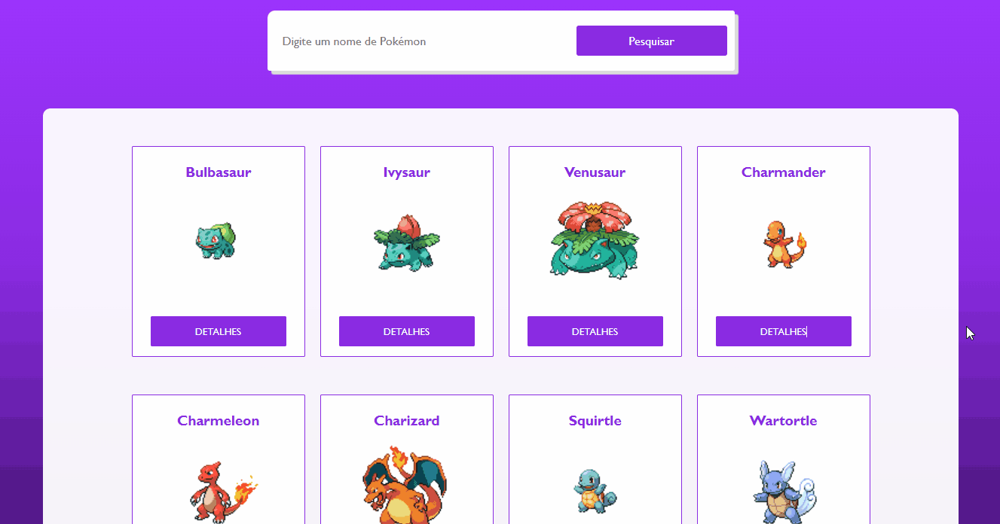

# Pokémon Dashboard





## Tecnologias
✔ HTML

✔ CSS

✔ JAVASCRIPT

✔ PYTHON

## 💻 Instalação

### Requirementos

- Você precisa instalar <a href="https://www.python.org/downloads/">Python</a> para rodar o projeto 

**Clona o projeto e acesse a pasta**

```bash
git clone https://github.com/DicousDev/Pokemon-Dashboard.git && cd Pokemon-Dashboard
```

### Dependências
```bash
# Instale as dependências necessárias
pip install Flask
pip install requests

# Rode o projeto
Abra o arquivo nomeado app.py
Aperte F5
Abra algum navegador, de preferência Chrome e acesse http://127.0.0.1:5000/
